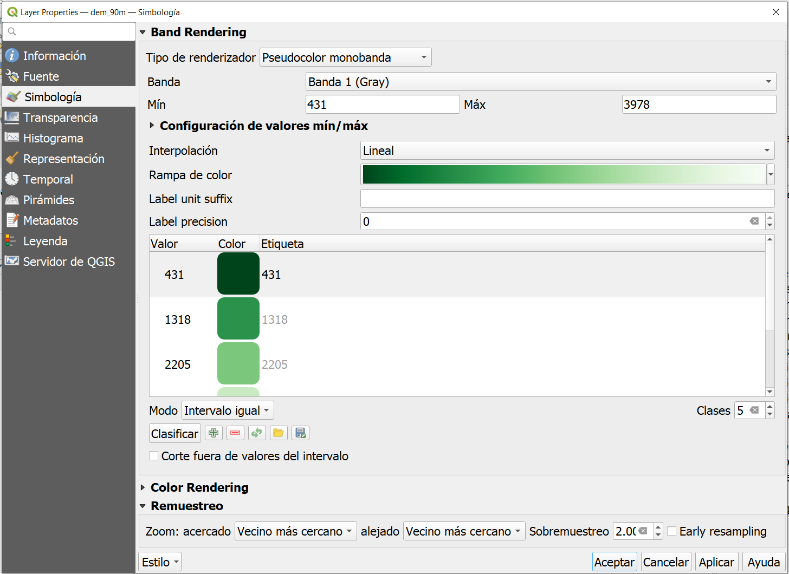
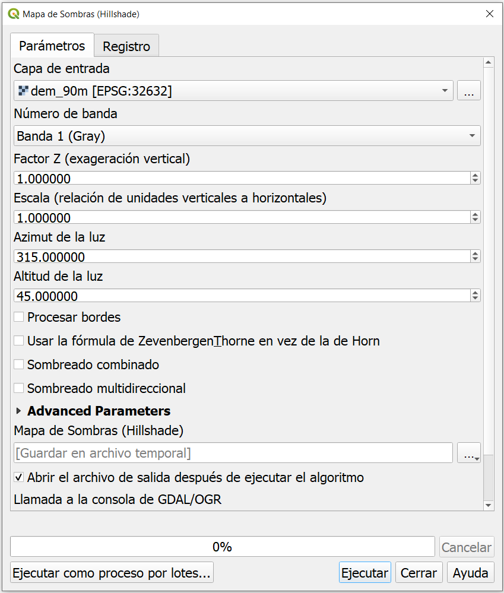
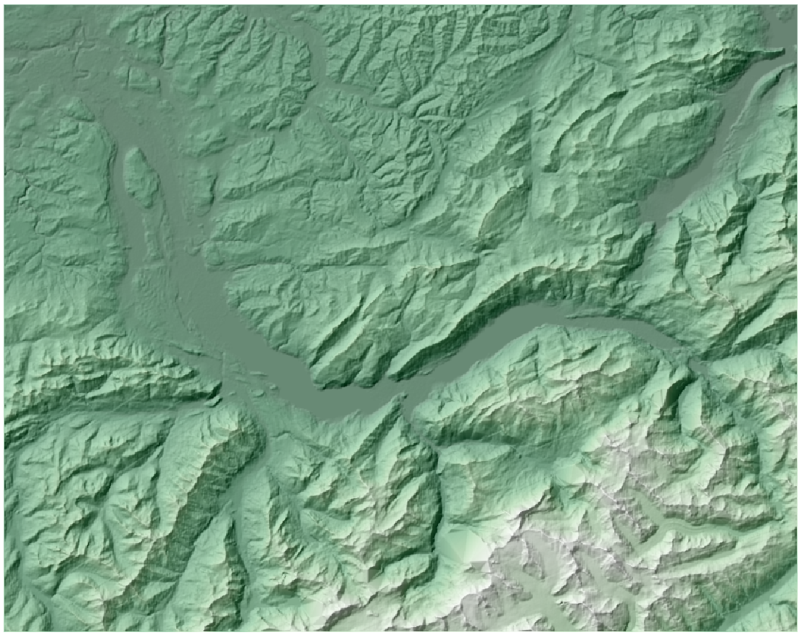

.. _shaded-models:

Sombreado del Terreno
=================================

Representanción de un Modelo del Terreno
-------------------------------------------

En QGIS, un modelo del terreno (DEM) se muestra generalmente usando una escala de grises de forma predeterminada, en la que se usa negro para los valores de celda más bajos y blanco para los valores de celda más altos. En un mapa, es preferble clasificar las alturas y mostrarlas usando tintes de capa. Para aplicar tientes a un DEM, vaya a  **Propiedades de capa > Simbología**:

#. Como *Tipo de renderizador* elija "Pseudocolor monobanda"; e **Interpolación** = Lineal;
#. Elija una **rampa de color** agradable, p. Ej. los "Verdes", como se muestra a continuación. Manipule la rampa de color de tal forma que los tintes oscuros se usen para los valores de celda más bajos, y tines claros para los valores más altos. Para ello, debe hacer clic en el botón de menú a la derecha de la *"rampa de color"*, y elegir  *"Invertir rampa de color"*.
#. Experimente con los colores, el tipo e intervalos de clasificación y otras configuraciones para obtener un buen tinte. Después de cambiar la configuración, no olvide hacer clic en el botón *"Clasificar"*.

Crear un Mapa de Sombras a partir de un DEM
--------------------------------------------

Puede crear un mapa de sombras para un DEM de la siguiente manera. Vaya al menú **Ráster> Análisis> Maa de Sombras**. Vea la imagen a continuación. La herramienta creará una iluminación hipotética sobre el modelo del terreno y determinará los valores de iluminación para cada celda en un ráster de elevación. Las sombras se modelan utilizando la posición de una fuente de luz y considerando la dirección y la pendiente del terreno. Un mapa de sombras puede mejorar en gran medida la visualización de una superficie. De forma predeterminada, la sombra y la luz se visualizan como tonos de gris asociados con valores enteros entre 0  y 255 (de negro a blanco).

Puede experimentar con algunas de estas opciones:

+ La configuración del *factor Z* proporciona una exageración opcional de las alturas.
+ La opción *Escala* debe usarse si las unidades de datos de altura no son las mismas que las unidades de coordenadas horizontales. En nuestro caso, ambas coordenadas están en metros. Aún así, si por ejemplo, uno tuviera un DEM en metros y una proyección en grados decimales, se debe usar una :math:`scala = 111120`.
+ *ZevenbergenThorne, Combinado y Multidireccional* son diferentes algoritmos para producir el mapa de sombras.

Combinar Mapa de Sombras y DEM
-------------------------------

Para combinar visualmente el mapa de sombras y el DEM, hága lo siguienteñ

1. En el panel de capas, coloque la capa DEM sobre el mapa de sombras.
2. Ajuste la transparencia de la capa DEM de tal forma que se dejen ver los detalles del mapa de sombras. Vaya a **Propieades de capa > Transparecia**, ajuste la el valor de transpacia entre 40 y 60 por ciento.

.. sectionauthor:: Barend Köbben & Andre Mano Da Silva