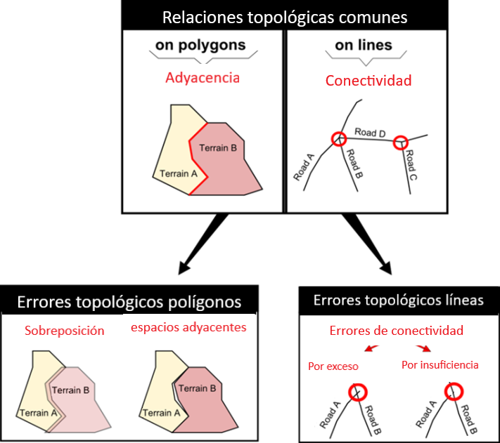
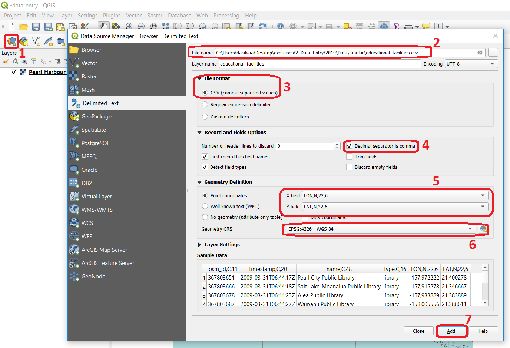

.. _sec-data-entry:

Adquisición de Datos
=======================

La |ltb| `adquisición de datos espaciales <Spatial data acquisition_>`_ se puede realizar usando varias fuentes. Se distinguen dos tipos generales: *fuentes primarias (directas) y fuentes secundarias (indirectas)*.

Adquisición Directa de Datos Espaciales
--------------------------------------------

La adqusición de datos directa include datos adquiridos (o producidos) utilizando, por ejemplo, |ltb| `fuentes de detección remota <Remote sensing_>`_, como imágenes de satélite.
Otras fuentes incluyen | ltb | `levantameintos aéreos <Aerial survey_>`_, |ltb| `Levantamientos topográficos <Aerial survey_>`_ y |ltb| `Crowdsourcing`_.  La idoneidad (fortalezas y debilidades) de cada fuente para un análisis espacial en particular, depende de los métodos de adquisición. 

.. attention:: 
   **Pregunta.**
    ¿Cuáles son las posibles ventajas y desventajas de utilizar las fuentes de datos enumeradas en la siguiente tabla? Escriba al menos una ventaja y una desventaja.

   ============================  ========= ============
     Fuente de Datos             Ventaja    Desventaja 
   ============================  ========= ============
     Sensores remotos            \           \
     Levantamiento aéreo [#]_    \           \
     Levantamiento topográfico   \           \
     Crowdsourcing               \           \
   ============================  ========= ============

   .. [#] Los levantameintos aéreos son una forma de sensores remotos, pero no desde el espacio.

-----------------------------

Adquisición Indirecta de Datos Espaciales
-------------------------------------------

Aunque los datos espaciales se puedan adquirir de fuentes como agencias gubernamentales o empresas, siempre existirá la necesidad de adquirir datos propios. Esto generalmente significa "digitalizar". La digitalización, también conocida como "vectorización", es el proceso de capturar objetos (puntos, líneas y polígonos) a partir de una capa base rasterizada como un mapa o una fotografía aérea. La digitalización es un método de captura de datos indirecto o **secundario**. 

.. attention:: 

   **Pregunta.**
   Lea y observe la relación entre |ltb| `Digitalización <Digitizing_>`_ y |ltb| `Escaneo <Scanning_>`_. ¿Es la digitalización la única forma de convertir un escaneo en datos espaciales?

.. important:: 
   **Recursos.**
   Necesitará la última versión LTR de `QGIS (Firenze 3.28) <https://qgis.org/downloads/QGIS-OSGeo4W-3.28.9-1.msi>`_, más el dataset `data_entry.zip <data_entry_>`_. Cuando descomprima el dataset encontrará los siguientes archivos:

   + ``data_entry.qgs`` – projecto QGIS; 
   + ``checking_errors.qgs`` – projecto QGIS;
   + ``Pearl_Harbour_topographic_map_(1999).tif`` – un mapa raster; 
   + ``Educational_facilities.csv`` – datos tabulares; 
   + ``Polygons.gpk`` – capa vectorial de polígonos. 

.. _`sec-digitising`:

Digitalización
^^^^^^^^^^^^^^^^^^^

La extracción de datos de un mapa ráster a una capa vectorial comienza con la creación de la capa de datos que almacenarán las entidades que se digitalizarán. Técnicamente hablando, ésta es una tarea sencilla; sin embargo, siempre se debe dedicar tiempo para planificar qué entidates (objetos) se digitalizarán antes de empezar a trabajar con el software.

La captura de entidades desde un mapa base es un ejercicio de abstracción; esta abstracción depende de la escala y el propósito para el que se utilizarán los datos. Por ejemplo, piense en los aeropuertos ¿Se deben representar (abstraer) como puntos o como polígonos? La respuesta a esta pregunta dependerá de cómo vaya a utilizar los datos. Si desea publicar un mapa mundi de los aeropuertos principales, probablemente debería representarlos como puntos. Pero si va a mapear las rutas de accesso a un aeropuerto determinado, se necesitará una escala mas grande; por lo tanto, una representación como polígonos serían más appropiados. 

Los |ltb| `atributos asociados <Associating attributes_>`_ con las geometrías son otro aspecto importante a considerar. La elección de los atributos depende no solo de la escala y el uso previsto, sino también de la disponibilidad de datos para los atributos. Por ejemplo, ¿Cuál es la capacidad del aeropuerto? ¿Cómo se clasifica el aeropuerto en términos de seguridad? ¿Cuántas conexiones internacionales tiene?. Se debe considerar si dicha información es necesaria, y si se tiene accesso a ella.

Práctica 1
   Inicie QGIS y abra el proyecto ``data_entry.qgs``. Entre otros, verá una capa llamada ``Pearl_Harbour_topographic_map_ (1999).tif``. Esta capa contiene un escaneo de un mapa topográfico. Observe el mapa y complete la tabla que aparece a continuación. Considere lo siguiente:

   + Piense en al menos tres capas vectoriales que se pueden digializar del mapa topográfico;
   + Asegúrese de que estén representados todos los tipos geométricos: polígono, línea, punto;
   + Para cada capa, piense en al menos dos atributos relevantes.

   =============== =============== ============= ===========
   Nombre de Capa  Geometría         Atributo 1  Atributo 2
   =============== =============== ============= ===========
   Tubería de agua línea            Código único  longitud 
   \               \                   \               \
   \               \                   \               \
   \               \                   \               \
   \               \                   \               \
   \               \                   \               \
   \               \                   \               \
   =============== =============== ============= ===========

Práctica 2
   Ahora que sabe capas de interés se pueden digitalizar y cómo abstraerlas, proceda con la creación de las nuevas capas. Digitalice al menos tres entidades por capa.

   Para completar esta práctica, vea el vídeo tutorial sobre `digitalización basica <https://youtu.be/savlyfomj28>`_:

.. raw:: html
    
   
<iframe width="560" height="315" src="https://www.youtube.com/embed/savlyfomj28" title="YouTube video player" frameborder="0" style="position:absolute;top:0;left:0;width:100%;height:100%;" allow="accelerometer; autoplay; clipboard-write; encrypted-media; gyroscope; picture-in-picture" allowfullscreen></iframe>

   

\

.. note:: 
   **QGIS.**
   Consulte la sección `Editar <https://docs.qgis.org/3.28/es/docs/user_manual/working_with_vector/editing_geometry_attributes.html>`_ en el manual de QGIS para una descripción detallada de cómo editar vectores.

.. _sec-topology-con:

Consistencia Topológica
^^^^^^^^^^^^^^^^^^^^^^^^^

|ltb| `Topología <Topology_>`_ se refiere a las relaciones espaciales que deben existir entre las geometrías de un conjunto de datos vectoriales, y se basan en el |ltb| `Modelo de datos topológicos <Topological data model_>`_. La topología es un tema complejo; en este ejercicio adoptaremos un enfoque prácitico y mostraremos cómo *mantener* las  |ltb| `relaciones topológicas <Topological relationship_>`_ más comunes: *adyacencia* para el caso de polígonos, y *conectividad* para el caso de líneas.

   Relaciones topológica comunes para polígonos, líneas, y puntos.

En la práctica anterior probablemente digitalizó carreteras o ríos usando líneas. Las carreteras y ríos topológicamente deben constituir una red (una serie de segmentos interconectados). La característica clave de una red es la *conectividad*. Sin embargo, es posible que tenga líneas digitalizadas que a simple vista parecen estar conectadas pero al hacer zoom sobre el punto en done deberían connectarse, verá que las líneas no están conectadas. Verá serán problemas de conectividad por exceso o por insuficiencia (también conocidos como *overshoots* y *undershoots* respectivamente). Un *Overshoot* occure cuando un línea es mucho más larga en comparación con la línea que debería conectarse. Un *Undershoot* ocurre cuando una línea es más corta que la línea con la que debería conectarse.

.. figure:: _static/img/under-shoot.png
   :alt: undershoot
   :figclass: align-center

   Problemas de conectividad entre líneas. "Undershooting"

Para garantizar |ltb| `Consistencia topológica <Topological consistency>`_ entre geometrías, como por ejemplo cuando queremos que los segmentos de líneas se conecten correctamente durante la digitalización, debemos configurar una *tolerancia de ajuste*. Ésta tolerancia le indicará al software GIS que conecte automáticamente las líneas que están dentro de cierta distancia. Sin este tipo de herramientas, sería muy difícil garantizar que las líneas de una red se conectaran.

Práctica 3
   En QGIS, vaya a :guilabel:`Proyecto` > :guilabel:`Opciones de autoensamblado` y click en :guilabel:`Habilitar autoensamblado` |snapping|. Ingrese una tolerancia de :math:`20 px` para cada capas de líneas que tiene en el proyecto.

   Si lo desea, vea el vídeo sobre  `edición avanzada y consistencia topológica <https://youtu.be/ISasBqj-d40>`_ :

.. raw:: html

   
<iframe width="560" height="315" src="https://www.youtube.com/embed/ISasBqj-d40" title="YouTube video player" frameborder="0" style="position:absolute;top:0;left:0;width:100%;height:100%;" allow="accelerometer; autoplay; clipboard-write; encrypted-media; gyroscope; picture-in-picture" allowfullscreen></iframe>

\

Práctica 4
   Digitalice algunas líneas nuevas asegurándose de que estén conectadas topológicamente. Lo notará durante la digitalización; si se acerca a los vertices de una línea existente, el puntero del ratón se "ajustará" automáticamente hacia el vértice o segmento más cercano. De este modo, se garantiza la conectividad durante el proceso de digitalización.

   En el caso de polígonos, también es posible asegurarse de que los polígonos adyacentes no se superpongan.

.. attention:: 
   **Pregunta.**

   + ¿Cómo criterios se pueden seguir para elegir una tolerancia apropiada para la herramienta de autoensamblado?
   + ¿Para qué sirven las opciones "Edición topológica" y "Autoensamblado en intersecciones"? Piense en situaciones en las que éstas opciones serían útiles.

.. note:: 
   **Reflexión.**
   Garantizar la consistencia topológica de datos vectoriales no es tan difícil si se tiene control sobre la técnica de adquisición de datos (vectorización) desde el momento en que se crea una capa de datos. Los problemas surgen cuando se reciben datos que fueron levantados por alguien más. En el segundo caso, siempre se debe verificar la consistencia topológica de los datos.

Práctica 5
   Inicie QGIS y abra el proyecto ``checking_errors.qgs``. Verá una capa (polígonos). Encuentre una manera de verificar si hay errores de superposición o adyacencia automáticamente. **Consejo:**  active el plugin **Comprobador de geometría**, :guilabel:`Complementos` > :guilabel:`Administrar e instalar coplementos` > :guilabel:`Comprobador de geometría` . Una vez activado, debería ser accesible desde el menú *Vectorial*.

   .. image:: _static/img/geometry-checker.png

En algunos casos, detectar y corregir errores topológicos no es tan sencillo. Solo tenga en cuenta que siempre debe verificar la integridad de los datos que recibe, especialmente si no se sabe el oringen o linaje de los datos.

.. _spatialising-data:

Espacialización de datos
^^^^^^^^^^^^^^^^^^^^^^^^^^

Otra forma de adquirir datos espaciales es mediante la espacialización de datos. En otras palabras, asociar una ubicación geográfica con un grupo de objetos geográficos. Este es un procedimiento muy común cuando se tiene una hoja de cálculo o algún tipo de datos tabulares que contienen registros que incluyen coordenadas.
 
Puede espacializar datos de dos formas. Mediante un *join* (concepto que se explorará más adelante en el curso), o mediante la construcción de geometrías de puntos a partir de datos tabulares que contienen coordenadas X e Y.

Práctica 6
   Espacialización de datos. Abra el proyecto ``data_entry.qgs`` y cree una capa de puntos usando el archivo ``education_facilities.csv``. Siga los pasos que se muestran en la captura de pantalla a continuación.

   Pasos para crear una capa de puntos a partir del archivo 'educational_facilities.csv'

.. attention:: 
   **Pregunta.**
   Si todo salió bien, debería haber creado con una capa de puntos en su proyecto. ¿Son los datos en el archivo ``Educational_facilities.csv`` datos espaciales?

.. sectionauthor:: André da Silva Mano & Manuel Garcia Alvarez  
