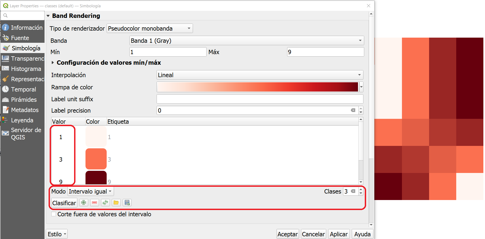
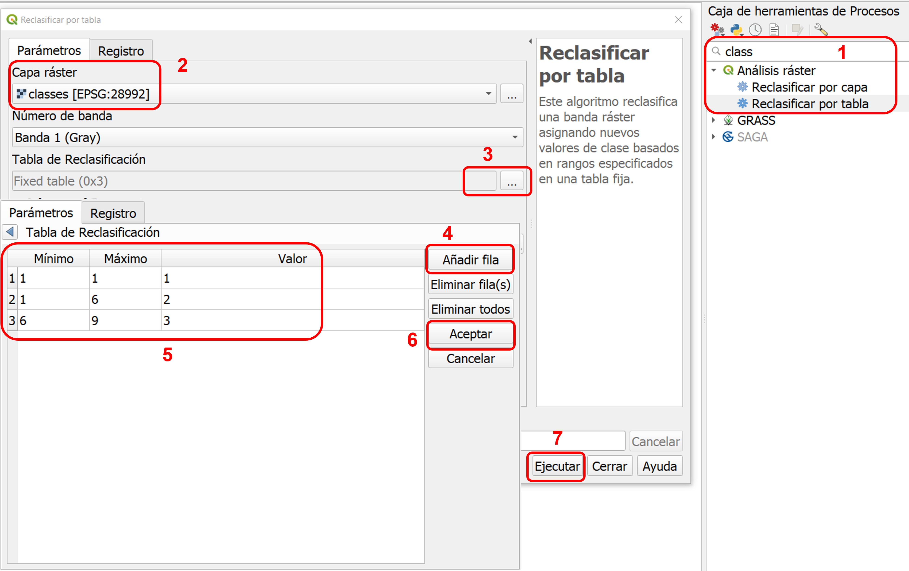
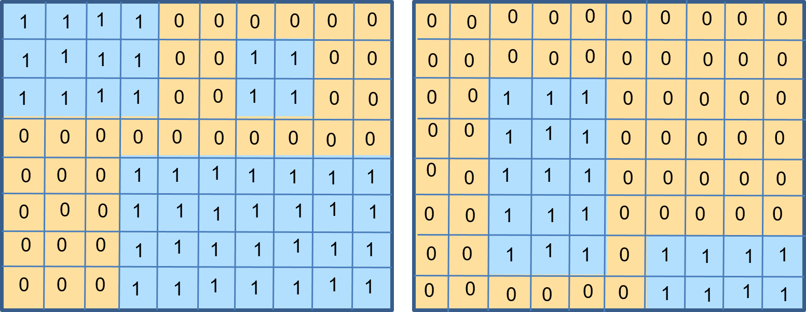
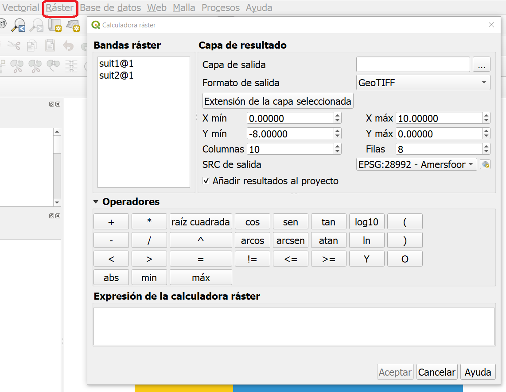
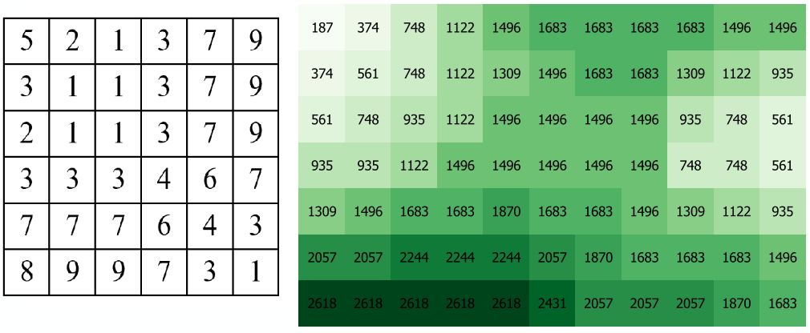
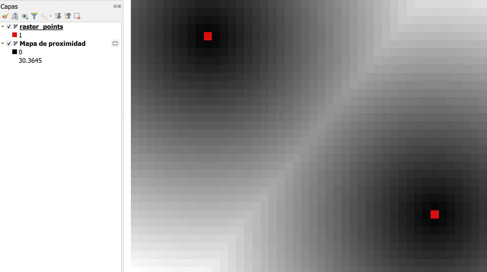
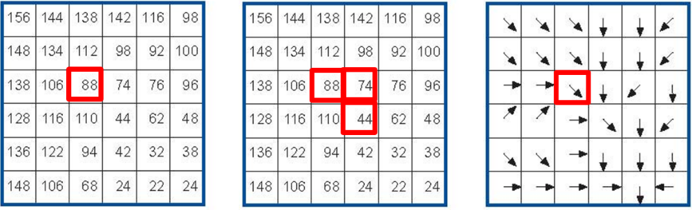
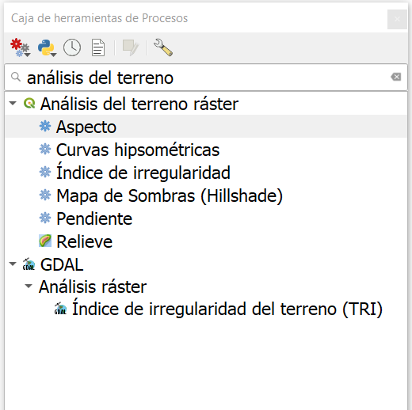

Análisis de Datos Ráster
==========================

.. _sec-reclass:

Reclasificación
----------------

Comience este ejercicio leyendo sobre el aspecto general de |ltb| `Reclasificación <Reclasificación_>`_.

.. attention:: 
    **Pregunta.**
    
    + Explique con sus propias palabras, ¿cuáles son las diferencias y similitudes entre clasificación y reclasificación?
    + ¿Cuál es la diferencia entre la reclasificación de datos vectoriales y la reclasificación de datos ráster?

Al aplicar una reclasificación a una capa ráster a menudo se reduce la cantidad de valores únicos del ráster. Los valores de celda se  agrupa y convierten en valores de clase. Mediante la reclasificación, el nivel de detalle origial en una capa ráster se puede reducir y ésto puede revelar patrones generales en los datos.
Existen diferentes métodos de clasificación para datos ráster, dos de ellos son: |ltb| `Clasificación controlada por el usuario <User controlled classification_>`_ y |ltb| `Clasificación automática <Automatic reclassification_>`_.

.. attention:: 
    **Pregunta.**
   
    + ¿En qué tipo de clasificación es relevante el posprocesamiento?

Clasificación Automática
---------------------------

.. important:: 
    **Recursos.**
    Necesitará la última versión LTR de `QGIS (Hannover 3.16) <https://qgis.org/en/site/forusers/download.html>`_, y los datos `raster-analysis.zip <raster_analysis_>`_. Para esta sección, necesitará los siguientes archivos:

    + ``classification.qgs`` – proyecto de QGIS con las siguentes capas;

        + ``classes.tif`` - un ráster 

Práctica 1
    A continuación verá una capa ráster representada como una matriz de valores. Clasifique los valores aplicando las técnicas de *intervalo igual (Equal Interval)* y *cuantil o frequencia igual (Equal frequency)*. Utilice cinco clases y anote los valores clasificados en las cuadrículas en blanco. Una froma de hacer esto es dibujar primero una tabla de atributos ráster con los valores únicos de las celadas y sus frecuencias, y luego determinar los nuevos valores de clase.

    .. image:: _static/img/task-reclass.png
       :align: center

Práctica 2
     La capa de entrada mencionada en la práctica anterior también es árte de los datos de este ejercicio. Abra el proyecto ``classification.qgs``, luego desde el :guilabel:`Panel de capas`, haga clic derecho sobre la capa  ``classes`` y aplique una simbología usando un clasificador de **intervalo igual**, :numref:`fig-auto-class`. Repita los pasos anteriores, y esta vez aplique un **clasificador de cuantiles**. Compare los resultados.

    .. _fig-auto-class:
    .. figure:: _static/img/task-auto-class.png
       :alt: automatic classification
       :figclass: align-center

       Clasificación automática desde la ventana de simbología.

----------------------------------

Clasificación Manual
---------------------

También puede controlar manualmente el número de clases y los rangos de valores que pertenecen a cada clase. Puede hacer esto usando los controles en el mismo menú de simbología, por ejemplo puede cambiar el **modo** y el número de **clases**. También, puede escribir directamente diferentes valores para cada clase. :numref:`fig-manual-class`. Además, puede definir reglas de reclasificación para crear un nuevo ráster.

.. _fig-manual-class:

   Clasificación manual usando la ventana de simbologia.

.. note:: 
   **QGIS.**
   Cuando clasifica un ráster usando el menú de simbología, no está cambiando los valores de los píxeles; simplemente está agrupando los píxeles con fines de visualización. Si desea generar un ráster cuyos valores de píxel se sobrescriban de acuerdo con las reglas de clasificación que decida, debe crear un nuevo ráster siguiendo los pasos descritos en la siguiente práctica.

Práctica 3
   Supongamos que desea crear un nuevo ráster que agrupe los valores (reclasifique los valores) de acuerdo con lo que se muestra en  la :numref:`fig-manual-class`. Es decir, una reclasificación con 3 clases (:math:`clase1 = 1, clase2 = 2 \ a \ 6,` y :math:`clase3 = 7 \ a \ 9`). Vaya a :guilabel:`Caja de herramietras de procesos` > :guilabel:`Clasificar por tabla` y escriba las reglas de reclasificación tal y como se muestran en la :numref:`fig-class-table`.

.. _fig-class-table:

   Pasos para creas un ráster usando la clasificación por tabla

.. note:: 
   **QGIS.**
   Recomendamos que en este punto instale el plugin **Value Tool**. Le permitirá ver los valores de píxeles de todos los ráster activos en ubicación del puntero del mouse. :numref:`fig-result-reclass`
   
   .. _fig-result-reclass:
   .. figure:: _static/img/result-reclass.png
      :alt: result reclassify by table
      :figclass: align-center

      Resultado de aplicar una clasificación manual usando la *clasificación por tabla*

   Consulte el manual de QGIS para saber cómo instalar plugins (*complementos*), sección `Instalación de nuevos complementos <https://docs.qgis.org/3.16/es/docs/training_manual/qgis_plugins/fetching_plugins.html>`_.

.. attention:: 
   **Pregunta.**

   + Si hay píxeles cuyos valores no se incluyen en ninguna regla de reclasificación, ¿qué valor se le asignará a esos píxeles en el nuevo ráster? Elija una de las siguientes opciones.
        + El nuevo ráster eliminará esos píxeles (es decir los convertirá en datos nulos)
        + El nuevo ráster asignará un valor aleatorio a esos píxeles
        + El nuevo ráster conservará los valores originales de ésos píxeles
        + Sucederá algo diferente, explique qué
   + Para poner a prueba su comprensión de las técnicas de clasificación; imagine que va a hacer un mapa que muestre el nivel de “felicidad” para los países del mundo en 2012. **Ustes desea reclasificar los datos en base al nivel de felicidad**. A continuación, verá un mapa y una gráfica de dispersión de los datos de felicidad. ¿Qué técnica de (re)clasificación aplicaría para este caso y por qué?

   .. image:: _static/img/happiness-map.png
      :align: center
    
   \

   .. image:: _static/img/happiness-plot.png
      :align: center

-----------------------------------------------

Superposición de Rásters
------------------------

Durante el ejercicio de vectores, ya conoció el concepto de superposición. En caso de que necesite refrescar su memoria, lea |ltb| `Análisis de superposición <Overlay Analysis_>`_.

Las operaciones de |ltb| `superposición de rásters <Raster Overlay_>`_ se pueden clasificar en cuatro grupos: **Aritméticas, Booleanas y Lógicas, Condicionales,** y **Tablas de decisión**. Estos métodos de superposición de rásters applican operaciones celda (pixel) por celda.

.. important:: 
   **Recursos.**
   Necesitará la última versión LTR de `QGIS (Hannover 3.16) <https://qgis.org/en/site/forusers/download.html>`_, y los datos `raster-analysis.zip <raster_analysis_>`_. Para esta sección, necesitará los siguientes archivos:

   + ``overlay.qgs`` – projecto de  QGIS con las capas:
      
      + ``suit1.tif`` - idoneidad sobre la cercanía a las escuelas
      + ``suit2.tif`` - idoneidad sobre la seguridad del vecindario

Operaciones Aritméticas
^^^^^^^^^^^^^^^^^^^^^^^^^

Imagine que quiere encontrar una ubicación para una nueva casa. Tienes dos criterios para la ubicación ideal: 1. cerca de una escuela y 2. en un vecindario seguro. Ha preparado dos capas de entrada; *'suit1'* contiene información sobre la cercanía a las escuelas, y *'suit2'* contiene información sobre la seguridad de los vecindarios.

Cuando se utilizan operadores aritméticos para combinar varias capas ráster, es imperativo saber el significado de los valores de las capas. Por ejemplo, los valores de las capas podrían representar la idoneidad para la nueva casa de la siguiente manera: *cero="no adecuado"* y *uno="adecuado"*. Se pueden utilizar operadores aritméticos para combinar los valores de éstas capas mediante la superposición de ráster; :numref:`fig-suit12`. Un método adecuado para obtener éstos **valores de idoneidad** es utilizar  :ref:`sec-reclass` para convertir las capas de entrada en una capa de idoneidad que únicamete contiene valores relantes para las clases de idoneidad. 

.. _fig-suit12:

   Valores de idoneidad para las capas de criterios para la ubicación de una nueva casa. Izquierda: 'suit1'. Derecha: 'suit2'

.. attention:: 
   **Pregunta.**

   + ¿Qué operadores aritméticos puede utilizar para combinar estas capas (suit1, suit2) y obtener una ubicación adecuada para la nueva casa?
   + ¿Cuántos valores diferentes podrían resultar en la capa de salida (resultado)?
   + ¿Cuál sería el área total de las zonas idóneas en la capa de salida?

Práctica 4
   Las capas que se muestran en :numref:`fig-suit12` también están disponibles como capas ráster en los datos para este ejercicio. Abra el proyecto ``Overlay.qgs`` y realice una superposición aritmética usando *'Suit1'* y *'Suit2'* como capas de entrada. Necesitará utilizar la **Calculadora ráster** :numref:`fig-raster-calc`. Luego verifique los resultados.

.. _fig-raster-calc:

   La calculadora ráster.

Operadores Lógicos y de Comparación
^^^^^^^^^^^^^^^^^^^^^^^^^^^^^^^^^^^^^^

Es posible que ya esté familiarizado con operadores lógicos (por ejemplo, ``Y, O, NO``) y de  comparación (por ejemplo, ``=, >, <=``). 
Suponga que las capas de entrada para una superposición de ráster aún no se han reclasificado para representar la idoneidad, por ejemplo en áreas *adecuadas* e *inadecuadas*, y por ello aún contienen los valores originales. En el ejemplo de la ubicación de una nueva casa, los valores originales  representan la percepción de seguridad para cada vecindario y la distancia a las escuelas.
Por tanto, el ráster de distancia contiene valores continuos (punto flotante), y el ráster de seguridad contiene valores discretos (enteros). Ver :numref:`fig-safety-school`.

.. _fig-safety-school:

   Capas ráster representando seguridad en los vecindarios (izquierda), y la distancia a las escuelas (derecha) 

Práctica 5
   Escriba una expresión para combinar las capas ráster en :numref:`fig-safety-school` usando operadores lógicos y de comparación. Tenga en cuenta que la estensión espacial  de las capas no es la misma, pero aún asi, se superponen. Asuma que para el ráster de la izquierda (seguridad), las celdas con valores 3 y 7 son adecuados. Para el ráster de la derecha (distancia a las escuelas), las celdas con valores por debajo de :math:`1000` son adecuados.

Práctica 6
   Los datos para el caso descrito en la práctia anterior están disponibles en las capas: ``classes.tif`` (seguridad) y ``dist2.tif`` (distancia a las escuelas). Cargue las capas en QGIS y pruebe su expresión en la **Calculadora de ráster**, vea si obtiene el resultado esperado.

.. attention::
   **Pregunta.**
   
   + ¿Cuántas celdas de salida son adecuadas?
   + ¿Cuál es la extensión de la capa ráster de salida?
   + ¿Cuál es el rango de valores de salida?

Operadores Condicionales
^^^^^^^^^^^^^^^^^^^^^^^^^^^^^^^^^^^^^^^^^^^^^^^

En el tipo de superposición anterior, los valores en la capa de salida siempre serán cero (inadecuado) o uno (adecuado). Sin embargo, a veces, nos gustaría generar valores que expresen el grado de idoneidad. Por ejemplo, 1 para no adecuado, 6 para razonablemente adecuado y 10 para perfectamente adecuado. Esto no es posible cuando se usan operadores lógicos únicamente. En su lugar podemos usar **premisas condicionales** y **tablas de decisión**.

.. note:: 
   **QGIS.**
   En la **Calculadora ráster**, las premisas condicionales (o *condiciones*) están implícitas en el resultado otros operadores. Por ejemplo, si tenemos dos ráster: *'raster1'* y *'raster2'*, y queremos  sumar  los valores de píxeles de *'raster1'* y *'raster2'* cuando el valor de un píxel en *'raster1'* es mayor que 5; podemos usar la siguiente expresión:

   .. code-block:: prolog
      :linenos:

      (( raster1@1 > 5) * raster1@1 + raster2@1)

   **Explicación.** 
   ``(raster1 @ 1 > 5)`` define una condición que devolverá 1 (*Verdadero*) cuando un píxel en *'raster1'* es mayor que 5, y 0 (*Falso*) en caso contrario. A continuación, obtenemos los valores originales en *'raster1'* usando una multiplicación: ``(raster1 @ 1> 5) * raster1 @ 1``. En ésta expresión, si un píxel en *'raster1'* es mayor que 5, el resultado será 1, y 1 multiplicado por cualquier valor siempre devolverá ese mismo valor.

   Finalmente, ``+ raster2 @ 1``  suma los valores en *'raster2'* luego de aplicar la condición indicada por la primera parte de la expresión que contiene el operador de comparación ``>``.
   Puede ver más ejemplos en la `documentación de QGIS <https://docs.qgis.org/3.16/es/docs/user_manual/working_with_raster/raster_analysis.html>`_.

Práctica 7
   siguiendo el caso explicado en :numref:`fig-safety-school`, escriba una expresión para la calculadora de ráster que use operadores condicionales para producir un ráster con diferentes niveles de idoneidad. *Defina al menos tres niveles de idoneidad.*

Tablas de Decisión
^^^^^^^^^^^^^^^^^^^^^^

Una alternativa al uso de operadores condicionales es el uso de **tablas de decisión**. Las tablas de decisión se utilizan a menudo cuando se usan muchas capas ráster como datos de entrada, o cuando el ráster de salida contiene clases con un valor que son el resultado de aplicar muchas condiciones. Puede ver un ejemplo al final de la explicación sobre |ltb| `Superposición de ráster <Raster Overlay_>`_.

Práctica 8
   Re-escriba la expresión condicional en la práctica anterior utilizando una tabla de decisión.

.. attention:: 
   **Pregunta.**
   ¿Cuál es la diferencia entre la reclasificación por tabla, y las tablas de decisión discutidas anteriormente?

---------------------------------------------------

Mediciones y Cálculos con Rásters
----------------------------------

Hay varias preguntas relacionadas con |ltb| `Mediciones ráster <Raster Measurements_>`_ que pueden responderse mediante el análisis de rásters. Por ejemplo.

+ ¿Qué tan lejos están dos ubicaciones?
+ ¿Cuánto mide una línea imaginaria sobre un raster?
+ ¿Cuál es la distancia al punto más cercano?
+ ¿Cuál es el área de la zona más cercana a éste punto?

.. important:: 
   **Recursos.**
   Necesitará la última versión LTR de `QGIS (Hannover 3.16) <https://qgis.org/en/site/forusers/download.html>`_, y los datos `raster-analysis.zip <raster_analysis_>`_. En esta sección, necesitará los siguientes archivos:

   + ``distance.qgs`` – projecto de QGIS con los siguientes capas de datos;

      + ``raster_points.tif`` - ráster con dos ubicaciones
   
   + ``surface_analysis.qgs`` – projecto de QGIS con los siguientes capas de datos;
   
      + ``mount_etna_dem.tif`` – un Modelo Digital del Terreno

Distancia
^^^^^^^^^^^^^^

La distancia en una capa ráster se puede medir usando los conceptos de distancia **"Euclidiana"** o de distancia **"centro de celda a centro de celda"**. La distancia euclidiana se mide desde el centro de la celda de origen hasta el centro de la celda de destino en línea recta. Sin embargo, para algunas operaciones se usa el concepto de distancia de *centro de celda a centro de celda*. Este concepto considera la  distancia definida por la línea más corta que une los centros de celdas adyacentes desde la celda de origen hasta la celda de destino. Es decir la línea que define la distacia entre dos ubicaciones debe siempre pasar por el centro de celdas adjacentes.

Práctica 9
   A continuación ve dos imágenes. En cada imagen hay celdas marcadas. Dibuje una línea para representar la distancia entre las dos celdas. Para la imagen de la *izquierda*, use el concepto de distancia euclidiana (línea recta entre los punto). Para  la image de la *derecha*, use el concepto de "centro de celda a centro de celda".

   .. image:: _static/img/task-ras-dist.png 
      :align: center

.. attention:: 
   **Pregunta.**
   ¿Qué tan lejos están las dos celdas de la práctica anterior si el tamaño de una celda (resolución) es :math: `10 \times 10 \ m`?

Práctica 10
   Calcule la distancia sobre una capa ráster. Abra el proyecto ``distance.qgs`` Verá una capa llamada *'raster_points'*. Vaya a :guilabel:`Raster` > :guilabel:`Análisis` > :guilabel:`Proximidad` y genere un mapa de distancia ráster. Responda las siguientes preguntas:

   + ¿Es posible seleccionar el tipo de distancia que desea medir?
   + ¿La herramienta **Proximidad** calcula la distancia euclidiana o la distancia siguiendo el centro de cada celda?

   Asegúrese de que la capa *'raster_points'* esté en la parte superior de las lista capas y use la herramienta **Value Tool** para inspeccionar los valores de los píxeles; :numref:`fig-ras-dist`. Esta herramienta le facilitará la interpretación de los datos.

.. _fig-ras-dist:

   Inspeccionando el ráster de distancias

Cálculo de Flujo
^^^^^^^^^^^^^^^^

El cálculo de flujo calcula el flujo a lo largo de la ruta de menor costo para cada celda. El cálculo del flujo se usa en análisis hidrográficos para determinar el camino que tomará una corriente de agua cuando fluye cuesta abajo.
El procedimiento para el cálculo de flujo consta de dos pasos:
   
   1. Cálculo del ráster de dirección del flujo
   2. Cálculo del flujo acumulado

Los datos de entrada para el cálculo del flujo son un campo continuo (en formato ráster). Por ejemplo, un modelo de elevación digital. El cálculo de la **dirección del flujo** se describe a continuación. Ver :numref:`fig-flow-comp`

   Para cada celda en la capa ráster de entrada (por ejemplo, celda 88), determinamos el vecino directo con el valor más pequeño (celda 74) y el vecino diagonal con el valor más pequeño (celda 44). Luego, calculamos la diferencias entre la celda objetivo y los vecinos de la siguiente manera: :math:`88 - 74 = 14 \ m` y :math:`88 - 44 = 44 \ m`. Sequidamente, calculamos la pendiente de los vecinos. Para ello, tenemos en cuenta la distancia entre los centros de cada celda. Si la resolución es :math:`10 \ times 10 \ m`, la pendiente para el vecino directo se calacuala :math:`14/10 = 1.4`, y la pendiente para el vecino indirecto se calcula :math:`44 / (10 * \ sqrt {2}) = 3.11`. Una vez hemos calculado la pendiente para cada vecino sabremos hacia qué celda fluirá el flujo desde la celda objetivo (celda 88). En este caso,  *el flujo fluirá hacia la celda 44, porque es la celda hace donde la pendiente es más mayor.*

Para calcular la **acumulación de flujo**, se deben contar par cada celda en el ráster de dirección de flujo, cuántas celdas fluyen hacia ellas. Para la celda en la :numref:`fig-flow-comp`, la acumulación de flujo es 7. Puede leer una explicación más detallada en |ltb| `cálculo de flujo <Flow_>`_.

.. _fig-flow-comp:

   Ejemplo ilustrativo del cálculo de flujo usando un modelo de elevación digital

Práctica 11
   Calcule la dirección (flow direction) y la acumulación  de flujo  (flow accumulation) para el ráster de elevación que se muestra a continuación. Use lápiz y papel.

   .. image:: _static/img/task-flow.png 
      :align: center

-------------------------------

Análisis de Superficie
-------------------------

El |ltb| `Análisis de superficie <Surface Analysis_>`_ consiste en cálculos como el ángulo de la pendiente, el aspecto de la pendiente, el sombreado (hillshade), etc. Un factor común en estos cálculos es que requieren datos de superficies continuas (por ejemplo, elevación) y se usan para identificar cambios en la superficie o la forma del terreno.

Práctica 12
   Abra el proyecto ``surface_analysis.qgis`` y use QGIS para calcular el *ángulo de la pendiente, el aspecto de la pendiente y el sombreado* para  el ráster con datos de elevación del monte Etna: *'mount_etna_dem'*.
   Utilice las herramientas de **Análisis del terreno ráster** en la caja de herramientas de procesamiento, :numref:`fig-ras-terrain`. Una vez que obtenga los resultados, use la herramienta  **Value Tool** para explorar los resultados.

.. _fig-ras-terrain:

   Herramientas para el análisis del terreno

.. sectionauthor:: Ellen-Wien Augustijn, André da Silva Mano, Manuel G. Garcia