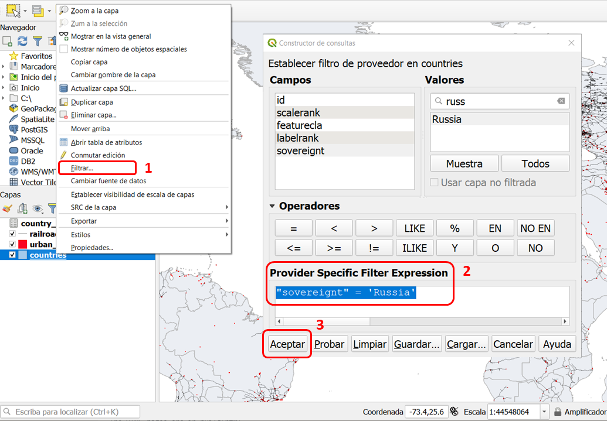
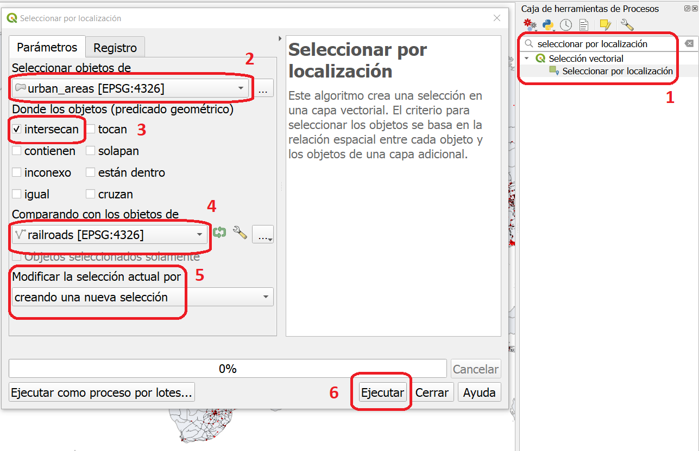
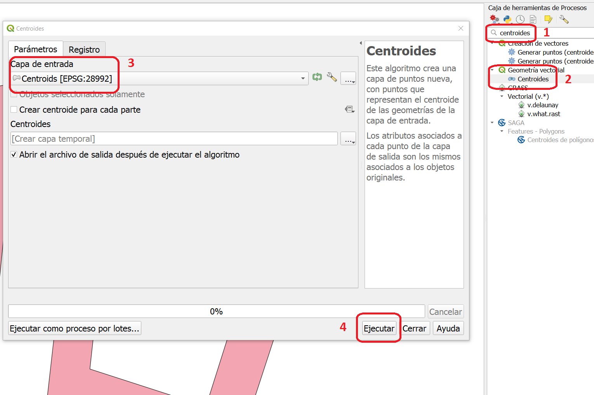
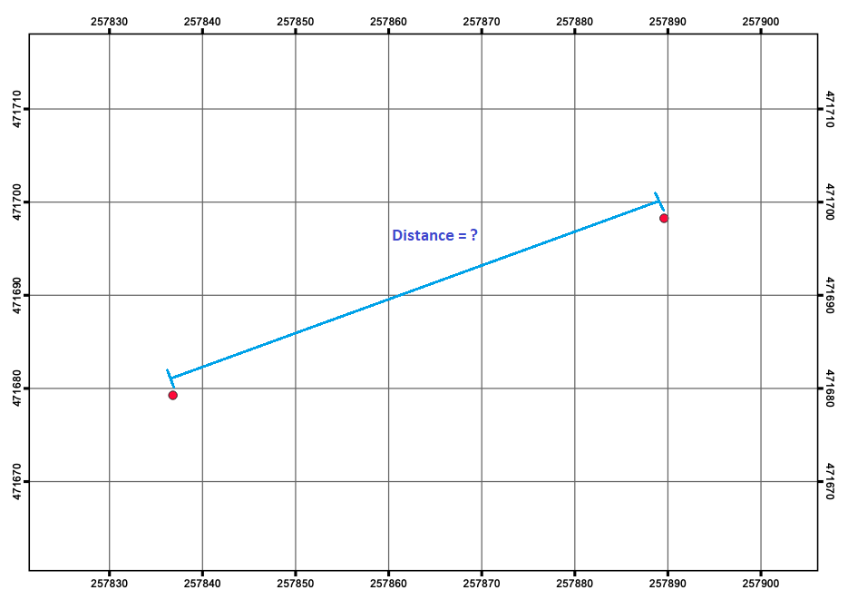
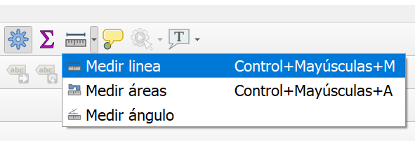
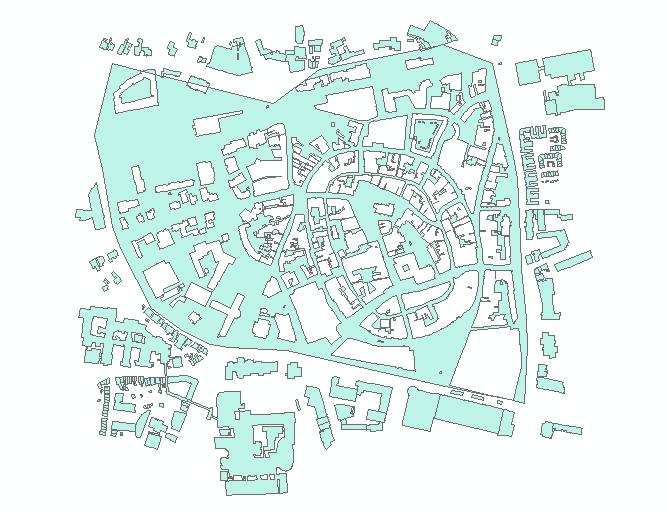
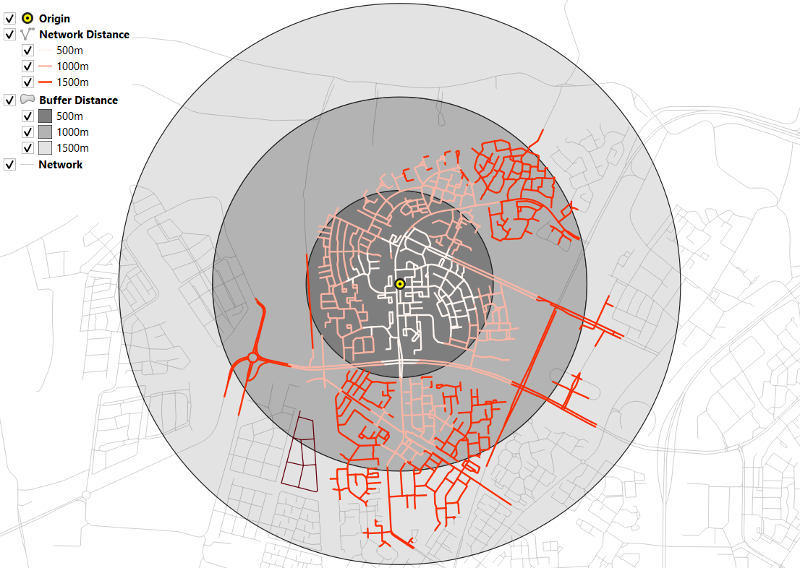

Análisis de Datos Vectoriales
================================

Los datos geográficos que usan  en el modelo de datos vectriales contienen dos partes impotantes. La primera parte son las geométrías (puntos, líneas o polígonos). La seguda parte son los atributos asociados con las geometrías. En este ejercicio se familiciará con las operaciones básicas para el análisis vectorial, las que incluyen la **selección de atributos, la sobreposción de geometrías, o una combinación de éstas.** 

Selección por Atributos
------------------------

La selección por atributos permite el selectionar elementos en una *capa vectorial* basandose en los valores de dichos atributos. En la selección por atributos se ignoran las relaciones espaciales entre los elementos geogmétricos de una capa. El resultado de una selección por atributos es un conjunto de elementso que cumplen con condiciones particulares. Por ejemplo, los países que tienen una población mayor a 10 millones, a los países que pertenecen al mismo continente.

En un SIG, la selección por atributos se utiliza generalmente para filtrar datos. A continuación aplicarará la seleccón de atributos para filtrar países que cumplen con ciertas condiciones, a través de la definición de **consultas**.

.. important:: 
   **Recursos.**
   Necesitará la última versión LTR de `QGIS (Firenze 3.28) <https://qgis.org/downloads/QGIS-OSGeo4W-3.28.9-1.msi>`_, el data set  `database_queries.zip <database_queries_>`_. Cuando descomprima el conjunto de datos encontrará los siguiente archivos:

   + ``Database_queries.qgs`` – un proyecto de QGIS con las capas que se listan a continuación
      + ``country_Data`` – una table con información sobre los países
      + ``database.sqlite`` – una base de datos que contiene: ``countries`` (países), ``railroads`` (vías de trenes) y ``urban_areas`` (áreas urbanas)
   + ``vectores`` - un folder que contiene los siguientes archivos:
      + ``countries.shp`` – una capa de países
      + ``railroads.shp`` – una capa de vías de trenes
      + ``areas-urbanas.shp`` – una capa de áreas urbanas   

Práctica 1
   Abra el proyecto QGIS *'database_queries'* y utilice el **constructor de consultas** para seleccionar las áreas territoriales que pertenecen a Rusia.  En la trabla de atributos de esta capa, el atributo  ``sovereignt`` significa *gobernado por*. :guilabel:`Haga clic derecho` sobre la capa de países (countries) > :guilabel:`Filtrar...`, defina la consulta que aparece a continuación y haga clic en :guilabel:`Aceptar`.
   Ver :numref:`figquerysimple`

.. _figquerysimple:

   Filtrado (selección por atributos) usando el constructor de consultas

\

Selección por Relación Espacial
--------------------------------

Las implicaciones de la primera ley de Geografía de Tobler son las que nos permiten buscar información basada en relaciones espaciales mientras ignoramos la semántica asociada con otras características. El punto clave que debe recordar es que *todos los objetos representados en el mismo espacio de coordenadas tienen al menos una cosa en común: ¡existen en mismo espacio!.* Esto significa que podemos filtrar  o seleccionar datos en función de relaciones topológicas como *disjoint, meets, equal to, inside, covers,* etc.

Práctica 2
   suponga que, usando los datos en el projecto de QGIS, queremos responder la pregunta **¿cuántas áreas urbanas están conectadas directamente con las vías férreas?** 
   Utilice la herramienta :guilabel:`Seleccionar por localización` de la **Caja de herramientas** para responder la pregunta. Vea la figura :numref:`figselectlocation`

.. _figselectlocation:

   Herramienta 'seleccionar por localización'

\

   Si todo salió bien, debería ver algunos de los elementos en la capa *'areas-urbanas'* resaltadas en amarillo. Esas son las áreas urbanas que **intersecan** al menos una vía férrea. *Para saber cuántas zonas urbanas se han selecionado, abra la tabla de atributos de la capa. En el encabezado de la tabla, verá el número de elementos seleccionados:* **1620**.

Mediciones Geométricas
-----------------------

El término "mediciones geométricas" describe mediciones que se hacen sobre de las propiedades espaciales de los elementos en una capa. Las mediciones geométricas incluyen:

+ ubicación.
+ distancia (distancia entre dos elementos)
+ longitud (longitud de un segmento de línea o límite de un polígono)
+ área (de elementos poligonales)

Ahora discutiremos estos tipo de mediciones. Una descripción general de |ltb| `operaciones geométricas <Vector Measurements_>`_ para el caso de datos vectoriales aparce este el hipevínculo.

.. important:: 
   **Recursos.**
   Necesitará la última versión LTR de `QGIS (Firenze 3.28) <https://qgis.org/downloads/QGIS-OSGeo4W-3.28.9-1.msi>`_, el data set  `database_queries.zip <database_queries_>`_, y el dataset `vector-analysis.zip <vector_analysis_>`_. Cuando descomprima el segundo archivo encontrará los siguiente:

   + ``Vector_analysis.qgs`` – un  proyecto de QGIS con los datasets listados a continuación;
   
      + ``Centroids.gpkg`` - cap de polígonos
      + ``DistancePoints.gpkg`` - Puntos para distancia
      + ``Linebuf.gpkg`` - Línea para buffer
      + ``Thiessenpoints.gpkg`` - Polígonos Thiessen
      + ``Overlay1.gpkg`` - Capa para sobreposición 1 
      + ``Overlay2.gpkg`` - Capa para sobreposición 2

Ubicación
^^^^^^^^^^^^^^^^

Un SIG siempre almacena la ubicación de elementos vectoriales. Para los elementos de tipo punto, se almacenan las coordenadas :math:`x` y :math:`y`. Para las líneas, se almacenan el nodo inicial, el nodo final y los vértices internos y, a veces, la longitud de cada segmento de la línea. Para los polígonos, se almacena los segmentos de línea que definen los límites, incluido el perímetro y el área del polígono. Sin embargo, a veces también se almacena el centroide de elementos tipo línea o polígono.

Práctica 3
   Entre los datos para este ejercicio encontrará un Shapefile llamado *'Centroids'* (centroides). Calcule los centroides para los polígonos en esta capa en QGIS. Luego, verifique si los centroides están dentro o fuera de los polígonos originales. La :numref:`fig-centroids` muestra los pasos.

.. _fig-centroids:

   Cálculo de centroides en QGIS

   El resultado es una capa de puntos con los centroides de los tres polígonos en la capa ``Centroids``. 

.. attention:: 
   **Pregunta.**
   ¿Puede dar un ejemplo de un caso en que sería útil calcular el centroide de un polígono?

Distancia
^^^^^^^^^^^^

Otra tipo de medición geométrica es la distancia. Calcular la distancia entre dos puntos en línea recta es una operación que se puede resolver usando matemáticas básicas (teorema de Pitágoras).

Práctica 4
   Abra QGIS y use la herramienta **Agregar atributos de geometría** para encontrar las coordenadas exactas de los puntos en la capa *'DistancePoints'*. Vaya a :guilabel:`Caja de herramientas` > :guilabel:`Geometría vectorial` > :guilabel:`Agregar atributos de geometría`. Selecione **DistancePoints** como :guilabel:`capa de entrada`, y clic en :guilabel:`Ejecutar`.  *Una nueva capa temporal se creará con las coordenadas* :math:`x` *y* :math:`y`. Abra la tabla de atributos de la nueva capa y verifique que las coordenadas se han agregado.

   .. important::
      + Cuando realice operaciones de medición geométrica, ponga mucha atención a las unidades del sistema de coordenadas en que se realizan y presentan los resultados.
      + Si desea guadar las coordenadas que se han calculado, deberá *exportar* la capa y guardala con un nuevo nombre.

 
Práctica 5
   Usando las coordenadas :math:`x, y` de la práctica anterior, calcule **manualmente** la distancia *euclidiana* entre los dos puntos en metros. Ver :numref:`fig-comp-dist`

.. _fig-comp-dist:

   Distancia en línea recta entre los puntos de la capa 'DistancePoints'

Práctica 6
   Con la herramienta **Medir línea** |measure|, mida la distancia entre los puntos en la capa *'DistancePoints'*. :numref:`fig-measure-tool`

.. _fig-measure-tool:

   Uso de la herramienta medir línea

.. attention:: 
   **Pregunta.**

   + Medir la distancia entere dos puntos es simple, especialmente cuando se usa una herramienta de medición y se dibuja la línea que se desea medir. En un software SIG también hay herramientas que pueden medir la distancia entre todos los elementos en una capa (ej. polígonos) y un el elemento más cercano en otra capa (e.j. línea). Pero, si consideramos que líneas y polígonos pueden ocupar un espacio geográfico muy amplio,   ¿Cómo se define la distancia entre un punto y una línea, o entre una línea y un polígono?. Elija una de las siguientes opciones, y explique su respuesta:

      + ¿La distancia mínima entre los elementos de las dos capas?
      + ¿La distancia entre los centroides de los elementos de las dos capas? o
      + ¿La distancia entre más corta entre los vértices de los elementos de las dos capas?

Otro tipo de medición geométrica es el cálculo de *minimal bounding box* (recuadro delimitador mínimo) de un elemento vectorial. El *minimal bounding box* es el rectángulo mínimo que encierra un elemento geográfico tipo línea o polígono.

Práctica 7
   Utilice la herramienta **Recuadros delimitadores** de la **Caja de herramientas** para visualizar los cuadros delimitadores mínimos de los elementos en la capa *'overlay2'*. Compare los resultados con la forma y tamaño de los elementos originales. 

-----------------------------------------

Sobreposiciones o Superposiciones
-----------------------------------

Las operaciones de |ltb| `Sobreposición vectorial <Vector Overlay_>`_ combinan dos capas de entrada (ya sea capas de puntos, líneas o polígonos) en una nueva capa de datos. La superposición de capas vectoriales aplican una o más de las siguientes operaciones:

+ Intersección de geometrías
+ Unión espacial de las tablas de atributos
+ Cálculo de la extensión de la capa de salida

Algunos operadores de superposición realizan tanto una intersección de la geometría como una unión espacial de las tablas de atributos, y el cálculo de la extensión espacial de la capa de salida (resultado). Otros operadores únicamente unen tablas de atributos o realizan intersecciones geométricas.

Práctica 8
   Usando los tres **operadores de superposición** de polígonos descritos en Living Textbook (clip [*cortar*], intersect [*intersección*], overwrite [*sobre-escribir*]), indique si el operator de sobreposición involucra las operaciones que se muestran a continuación:

   =============================  ===================================    =============================  ========================================= 
   Operador de Sobrepoción [#]_   Intersección geométrica                 Unión de atributos             Operador de la extensión espacial
   -----------------------------  -----------------------------------    -----------------------------  -----------------------------------------
   \                              (Sí/No/parcialmente)                    (Sí/No)                       (AND/OR)
   =============================  ===================================    =============================  ========================================= 
   Intersect (Intersección)        \                                       \                             \     
   Clip (Cortar)                   \                                       \                              \      
   Overwrite (sobre-escribir)      \                                        \                             \      
   =============================  ===================================    =============================  ========================================= 

   .. [#] Hay muchos más operadores de sobrepoción que los que se listan en esta tabla.

Práctica 9
   Encuentre las herramientas **Unión, Intersección ** y **Cortar** en la **Caja de herramientas**, y utilícelas para aplicar dichas operaciones de superposición utilizando las capas *'overlay1'* y *'overlay2'* como capas entrada. Compare las characteristicas de los resultados con la tabla anterior.

*"El operador fundamental de todas las operaciones de superposcion en la práctica 9 es la* **intersección de polígonos**. *Todos los operadores de sobreposición se pueden definir en términos de la intersección de polígono, generalmente en combinación con la selección y/o clasificación de polígono".* A continuación, verá el resultado de la operación de superposición llamada: **Diferencia simétrica** entre las capas *'overlay1'* y *'overlay2'*. :numref:`fig-symdif`

.. _fig-symdif:

   Diferencia simétrica entre las capas 'overlay1' y 'overlay2'

.. attention:: 
   **Pregunta.**
   ¿Qué operaciones debería hacer para obtener el resultado generado por la herramienta de diferencia simétrica, pero usando sólomente la *herramienta de intersección* y los *operadores de selección*? Describa los detalles de su procedimiento.

-----------------------------------------

Operadores de proximidad
---------------------------

Seguidamente exploraremos dos operaciones de proximidad: |ltb| `Bufer <Buffer_>`_ y |ltb| `Polígonos de Thiessen <Thiessen Polygons_>`_.

Un buffer puede crearse para capas con puntos, líneas y polígonos. Se pueden crear buffers para todas las entidades de una capa o solo para los elementos seleccionados. Se puede usar una **distancia de búfer fija**; en cuyo caso, se creará un búfer del mismo tamaño para todos los elementos en una capa. O podemos usar una **distancia de búfer variable** para cada elemento; en cuyo caso las distancias para cada buffer deben almacenarse en la tabla de atributos de la capa.

Práctica 10
   Abra la tabla de atributos de la capa *'linebuf'*. Encontrará un atributo llamado **bufdist**. Utilice este atributo para generar buffers con distancias variables. Vaya a :guilabel:`Caja de herramientas` > :guilabel:`Variable ancho del buffer (por valor M)`. en :guilabel:`Capa de entrada` selecione la capa *'Linebuf'*, y en :guilabel:`Campo de ancho` selecione el atributo *'bufdist'*. Haga clic en :guilabel:`Ejecutar`. 

   .. note::
      La herramienta de búfer variable parece no estar funcionando en la versión 3.28 de QGIS. Si el processo termina con errores. Intente con la herramienta :guilabel:`Features Buffer` en la sección llamda *SAGA*. Si aún así no funciona, omita esta parte.

   Cree un buffer para la capa *'linebuf'* usando una distancia fija. :guilabel:`Caja de herramientas` > :guilabel:`Búfer multi-anillos (distancia constante)`.

.. attention:: 
   **Pregunta.**
   Se dice que los búferes generan áreas que son discretas. ¿Puede explicar qué significa esto y dar un ejemplo en el que ésto pueda ser un problema para un análisis de datos?

Otro ejemplo de operadores de proximidad son los Polígono de Thiessen. Si ya está familiarizado con el concepto de *Polígonos Voronoi*, los polígonos de Thiessen son lo mismo; identifican las áreas más cercanas (en *distancia euclidiana*) para los puntos en una capa.

Práctica 11
   En la **caja de herramientas**, encuentre la herramienta para crear polígonos Thiessen en QGIS. Recuerde que los polígonos de Thiessen también se llaman  polígonos Voronoi, en QGIS se uas éste último término.

   Utilize la herramienta de polígonos Voronoi usando la capa ``Thiessenpoints`` como capa de entrada. Examine el resultado.

.. note:: 
   **Reflexión.**
   Este sitio web se comparan los polígonos de Thiessen con formas que se encuentran en la naturaleza, como las manchas de una jirafa: http://forum.woodenboat.com/showthread.php?112363-Voronoi-Diagrams-in-Nature

---------------------------------------

.. _sec-networks:

Redes
--------
En un SIG las redes se unitilizan para representar phenómenos geográficos que requieren modelar el flujo de propiedades entre diferentes ubicaciones. Por ejemplo, redes pluviales hidrológicas (ríos), redes de transporte de personas, entre otras.

Características de las redes
^^^^^^^^^^^^^^^^^^^^^^^^^^^^^^^

Hay dos aspectos importantes en un |ltb| `Red <Network_>`_; la **dirección** de la red y el **grado en que la red es plana**. Cuando comprenda éstos dos conceptos, sabrá por qué las redes se modelan de manera diferente y por qué no todas las |ltb| `técnicas de análisis <Network Analysis_>`_ son relevantes para todos los tipos de redes.

Práctica 12
   Complete la siguiente tabla sobre las characteristicas general de los diferentes tipos de redes.
   
   ========================    =======================    =========================    =======================
   Ejemplo de Red               Plana o No-plana           Dorigida o No  Dirigida       Tipo de análisis [#]_ 
   ========================    =======================    =========================    =======================
   Red de ríos                   \                          \                          \
   Red de carreteras             \                          \                          \
   Red tendido eléctrico         \                          \                          \
   Red de drenajes               \                          \                          \
   ========================    =======================    =========================    =======================

   .. [#] Elija una de las siguientes: 'búsqueda de ruta óptima', 'asignación de red' o 'rastreo'.

Modelado y Análisis  Red
^^^^^^^^^^^^^^^^^^^^^^^^^^^^

Las redes constan de puntos (nodos) y líneas (segmentos). Lo más importante para una red es la conectividad. Por lo tanto, un espacio entre segmentos implica que el flujo a través de la red se detiene. La topología de líneas se usa para asegurar que los puntos y líneas  que forman una red se mantegan conectados.

En el modelado de datos aprendimos que una línea tiene un **'nodo inicial'** y un **'nodo final'**. Estos conceptos, se usan para representar su dirección. Cuando hablamos de la dirección en una red, denominamos a los nodos inicial y final,  como **'nodo inicio'** y **'nodo destino'**, respectivamente. En el análisis de redes, se usa una **función de costo** para representar *'impedancia'*; es decir, *una función que determina el costo de usar un segmento, o pasar por un nodo en la red*. Las funciones de costo se almacenan como un atributo que indica el costo de viajar por cada segmento (o nodo) de la red. La |ltb| `búsqueda de ruta óptima <Optimal Path Finding_>`_ es un ejemplo de análisis de redes que utiliza funciones de costos.

Práctica 13
   Use papel y lápixz para determinar la ruta óptima de una red. A continuación, verá una red de carreteras (izquierda) con los ID (identificador) de cada segmento de la red. A la derecha, verá una tabla (atributos) con el costo asociado con cada segmento. **¿Cuál es la ruta de menor costo entre el punto de origen (start-point) y el punto destino (end-point)?**

   .. image:: _static/img/task-cost.png 
      :align: center

En la práctica anterior, solo había una función de costo que se aplica en cualquier dirección. Hay muchas razones por las que el costo puede ser diferente dependiendo de la dirección en la que se viaja en una red. Por ejemplo en una red vial, diferentes límites de velocidad, diferente número de carriles o differentes niveles de tráfico.

Práctica 14
   Use papel y lápiz para determinar la ruta óptima de la **red dirigida** que aparece a continuación. Ésta vez considere las dos funciones de costos; un costo para la dirección 'a favor' (Cost TF) para cuando se mueve en la dirección de las flechas, y un costo 'encontra' (Cost FT) para cuando se mueve en la dirección opuesta. *Vuelva a calcular la ruta óptima, ésta vez los puntos de inicio y destino son diferentes.* **¿Cuál es la ruta de menor costo desde el punto de origen hasta el punto de destino? ¿Es el resultado igual que el anterior?**

   .. image:: _static/img/task-dir-cost2.png 
      :align: center

.. attention:: 
   **Pregunta.**
   Una función de costo se puede asociar a los segmentos (como en las tareas anteriores) o a los nodos de una red. ¿En que casos sería util aplicar funciones de costo a los nodos de una red?

Temas más avanzados sobre análisis de redes incluyen: |ltb| `Partición de red <Network Partitioning_>`_, |ltb| `Asignación de redes <Network Allocation_>`_ y |ltb| `Análisis de rastreo <Trace Analysis_>`_. La partición de redes es un grupo de funciones analíticas que divide una red en partes dependiendo de su ubicación. En la asignación de redes, partes de una red se asignan a áreas específicas llamadas  áreas de servicio. En el análisis de seguimiento, parte de la red también se asigna a ubicaciones particulares, pero su uso está restringido a redes dirigidas.

.. attention:: 
   **Pregunta.**
   En sus propias palabras. ¿Cuáles son las diferencias y similitudes entre los polígonos Thiessen y la asignación de red?

Práctica 15
   :numref:`fig-buffer-network` muestra  los resultados de aplicar dos tipos de análisis a datos vectoriales:

   1. El resultado de un buffer (multi-anillo) alrededor de un punto (punto amarillo). Cada anillo (*Buffer Distance*) está separado por una distancia de :math:`500 \ m`.
   2. El resultado de aplicar la asignación de redes alrededor del mismo punto (*Network Distance*). Cada sección coloreada de la red de caminos está separada también por una distancia de :math:`500 \ m`.

   **Describa la diferencias entre los resultados de cada análisis y las razones detrás de esas diferencias.**

.. _fig-buffer-network:

   Buffer mult-anillo y assignación de redes  alrededor de un mismo punto de origen.

.. attention:: 
   **Pregunta.**

   + ¿En qué tipos de redes podemos aplicar el análisis de rastreo?
   + ¿Cuáles son las características que debe tener una red para aplicar el análisis de rastreo?

.. sectionauthor:: Ellen-Wien Augustijn, Andre da Silva Mano, Manuel Garcia Alvarez
